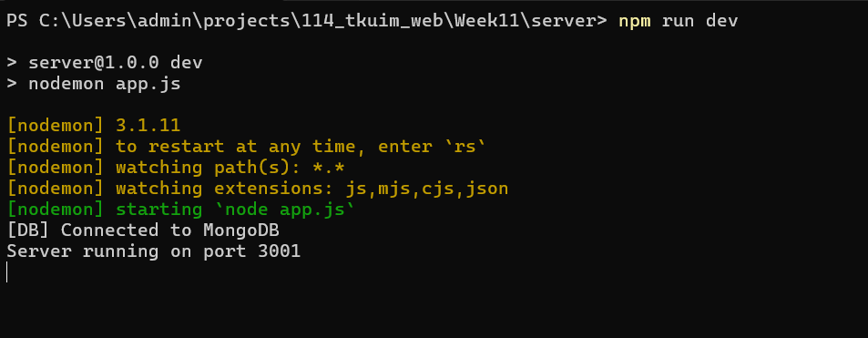
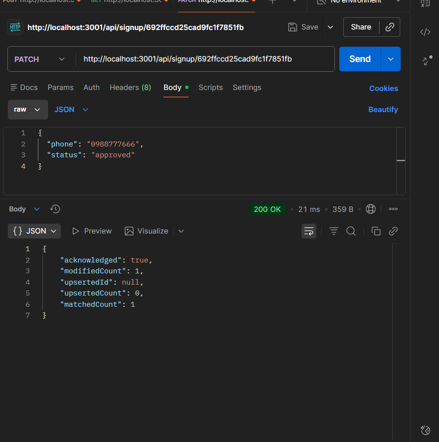
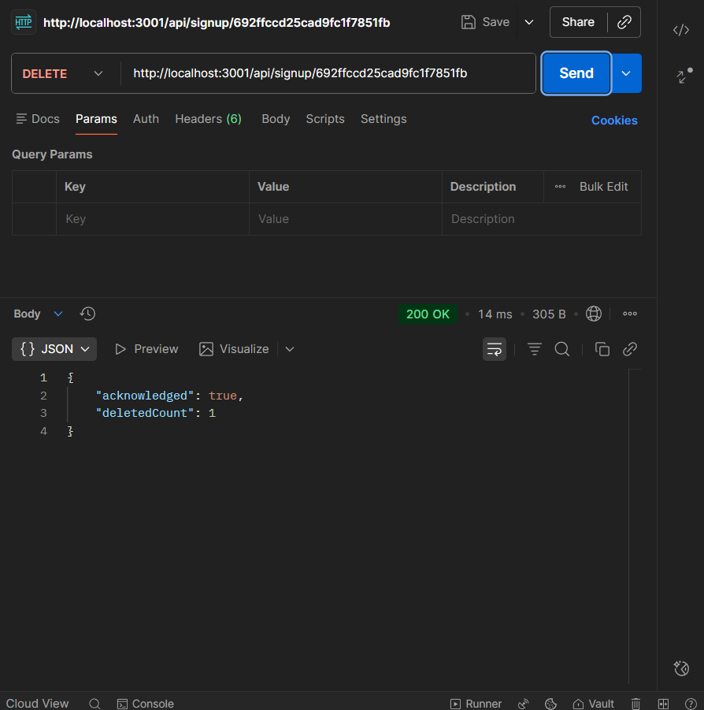
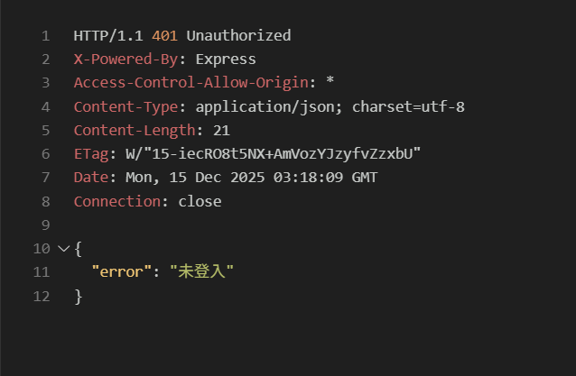
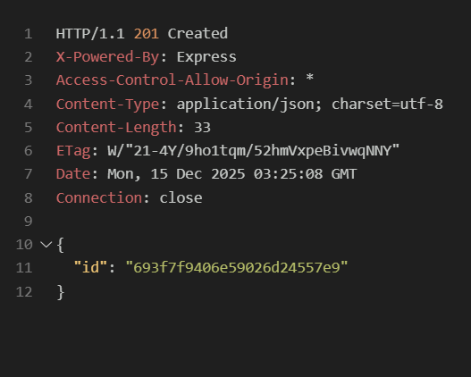
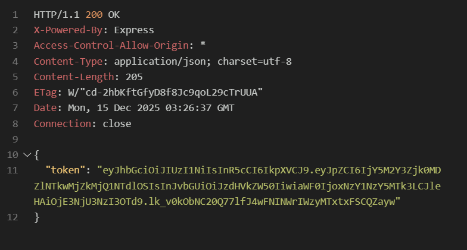
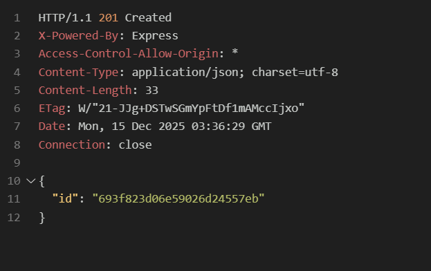
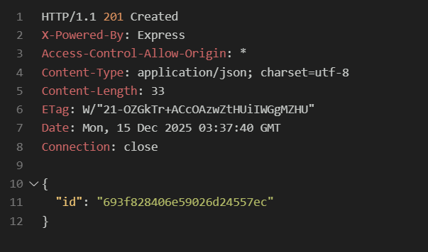

- CRUD(Create,Read,Update,Delete)，是對資料庫做的四個動作，通常是為了針對某個特定資源做出的舉動。最常見的用途是在使用SQL資料庫與網站的API埠口的時候，基本上這四個動作行為就可以完成網站上常見的功能。
- Create 建立 SQL:INSERT HTTP:PUT/POST
- Read 讀取 SQL:SELECT HTTP:GET
- Update 更新 SQL:UPDATE HTTP:PUT/POST/PATCH
- Delete 刪除 SQL:DELETE HTTP:DELETE

1.docker compose up -d 啟動容器，docker ps查看容器狀態

2.使用Mongo Composs確認Participants集合存在

3.npm run dev確保伺服器能連線mongodb

4.完成API

POST /api/signup：建立報名並回傳 _id。

GET /api/signup：回傳清單及 total

PATCH /api/signup/:id：可更新 phone 或 status。

DELETE /api/signup/:id：刪除特定報名。

### Week12
- 啟動流程
1.  啟動MongoDB
2.  設定環境變數
3.  啟動後端Server
4.  API測試
- API測試
1. 未登入
   

- 建立Student帳號
   

- 建立Admin帳號
   

- student 登入->取得token
   

- admin登入 ->取得token
   

- student 新增報名
   

- admin 新增報名
   

- student 查詢 → 只能看到自己的
   

- admin 查詢 → 看到全部
    

-  student 嘗試刪除 
    

-   admin 刪除任一筆 → 204

