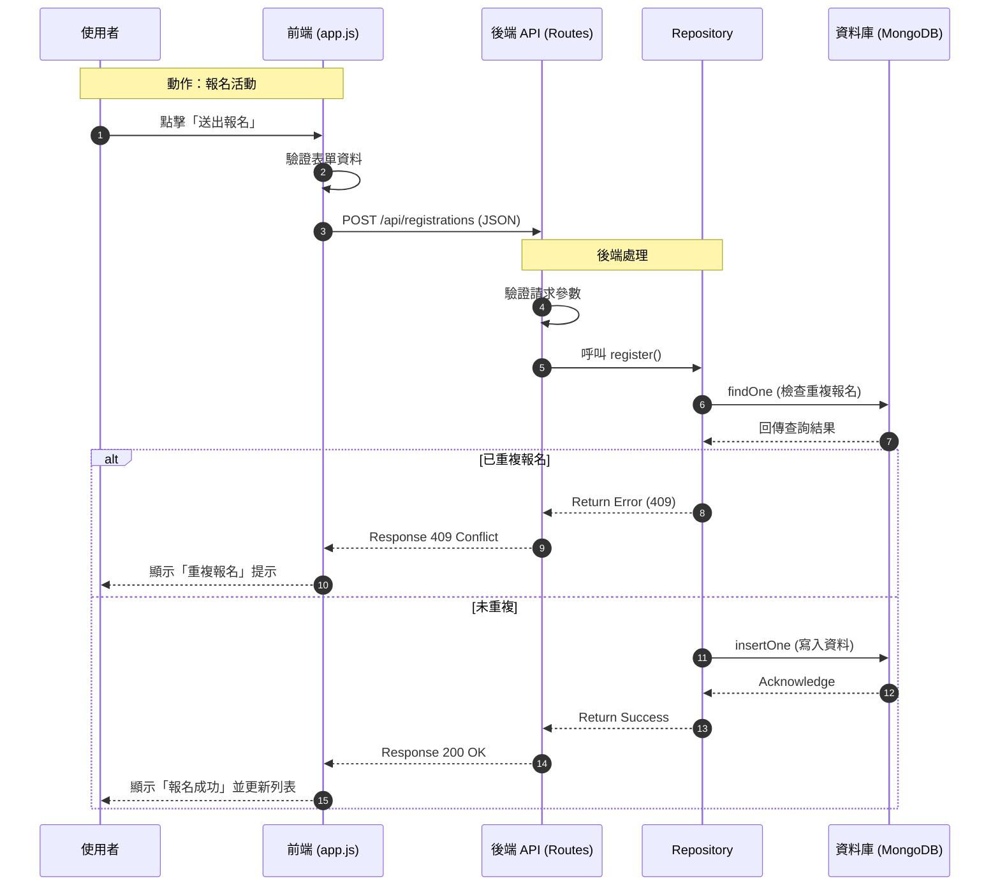

# 系統架構與流程圖

## 1. 系統架構圖 (System Architecture)

```mermaid
graph TD
    User[使用者 (Browser)]
    
    subgraph Frontend [前端 (Frontend)]
        UI[網頁介面 (HTML/CSS)]
        Logic[應用邏輯 (app.js)]
        API_Client[Fetch API]
    end

    subgraph Backend [後端 (Node.js/Express)]
        Server[Web Server]
        Router[路由 (Routes)]
        Repo[資料存取層 (Repositories)]
    end

    subgraph Database [資料庫 (MongoDB)]
        DB[(MongoDB)]
    end

    User <-->|互動| UI
    UI <--> Logic
    Logic <--> API_Client
    API_Client <-->|HTTP Request/Response| Server
    Server <--> Router
    Router <--> Repo
    Repo <-->|CRUD Operations| DB
```

## 2. 資料流 CRUD 流程圖 (Data Flow)

描述：使用者透過前端進行操作（如報名活動），資料流經後端處理並寫入資料庫的過程。


